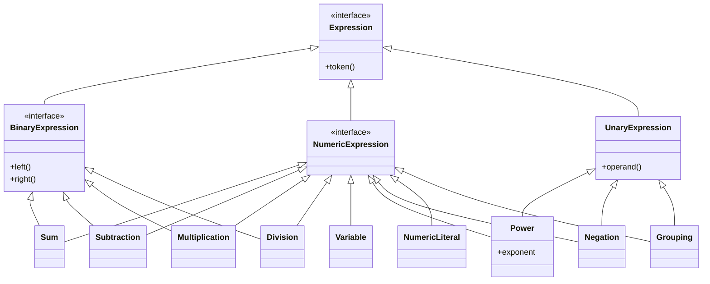
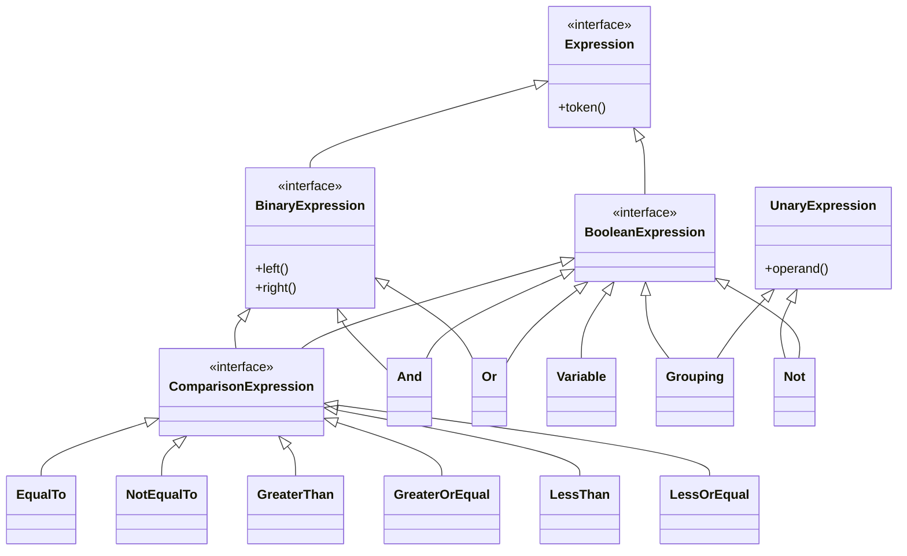

# Class Hierarchy Declarations





```
interface Expression
    permits NumericExpression, BooleanExpression, FunctionLiteral, FunctionCall

    interface NumericExpression extends Expression
        permits Variable, NumericLiteral, Sum, Multiplication, Inversion, Power
        
    record NumericLiteral(Numeric value)
        implements NumericExpression
    
    record Sum(List<NumericExpression> terms)
        implements NumericExpression
    
    record Multiplication(NumericExpression left, NumericExpression right)
        implements NumericExpression
        
    record Power(NumericExpression operand, int exponent)
        implements NumericExpression 
    
interface BooleanExpression extends Expression
    permits ComparisonExpression, BooleanLiteral, Variable, Not, And, Or
    
    interface ComparisonExpression extends BooleanExpression
        permits LessThan, LessOrEqual, GreaterThan, GreaterOrEqual
        
        record GreaterOrEqual(NumericExpression left, NumericExpression right)
            implements ComparisonExpression
            
        record GreaterThan(NumericExpression left, NumericExpression right)
            implements ComparisonExpression
            
        record LessOrEqual(NumericExpression left, NumericExpression right)
            implements ComparisonExpression
            
        public record LessThan(NumericExpression left, NumericExpression right)
            implements ComparisonExpression
        
    record BooleanLiteral(Bool value)
        implements BooleanExpression
    
    record Not(BooleanExpression operand)
        implements BooleanExpression
    
    record And(BooleanExpression left, BooleanExpression right)
        implements BooleanExpression
        
    record Or(BooleanExpression left, BooleanExpression right)
        implements BooleanExpression
        
record FunctionLiteral(List<String> formalParameters, Expression body)
    implements Expression

record FunctionCall(FunctionValue function, List<Expression> actualParameters)
    implements Expression           
```