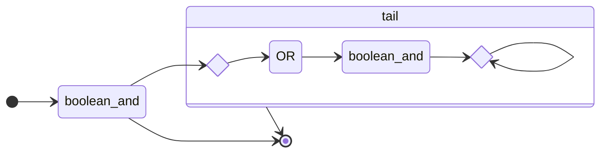

# Grammar



```
expression -> boolean_or ;

boolean_or -> boolean_and (OR boolean_and)*

boolean_and -> equality (AND equality)* 

eauality_operator  -> NOT_EQUAL 
                    | EQUAL
                     
equality -> comparison equality_operator comparison
          | comparison

comparison_operator -> LESS_THAN
                     | LESS_OR_EQUAL
                     | GREATER_THAN
                     | GREATER_OR_EQUAL
                     
comparison -> term comparison_operator term
            | term
    
unary_boolean_operator -> NOT

unary_boolean -> unary_boolean_operator unary_boolean*
               | primary 
   
primary -> BOOLEAN_LITERAL
         | numeric_expression
                            
numeric_expression -> term    
            
add_operator -> ADDITION
              | SUBTRACTION
                        
term -> factor (add_operator factor)*

mul_operator -> DIVISION
              | MULTIPLICATION
              
factor -> unary_numeric (mul_operator unary_numeric)*

unary_numeric_operator -> NEGATION

unary_numeric -> unary_numeric_operator unary_numeric*
               | numeric_primary


numeric_primary -> NUMERIC_LITERAL
         | IDENTIFIER
         | OPEN_PAREN expression CLOSE_PAREN
```